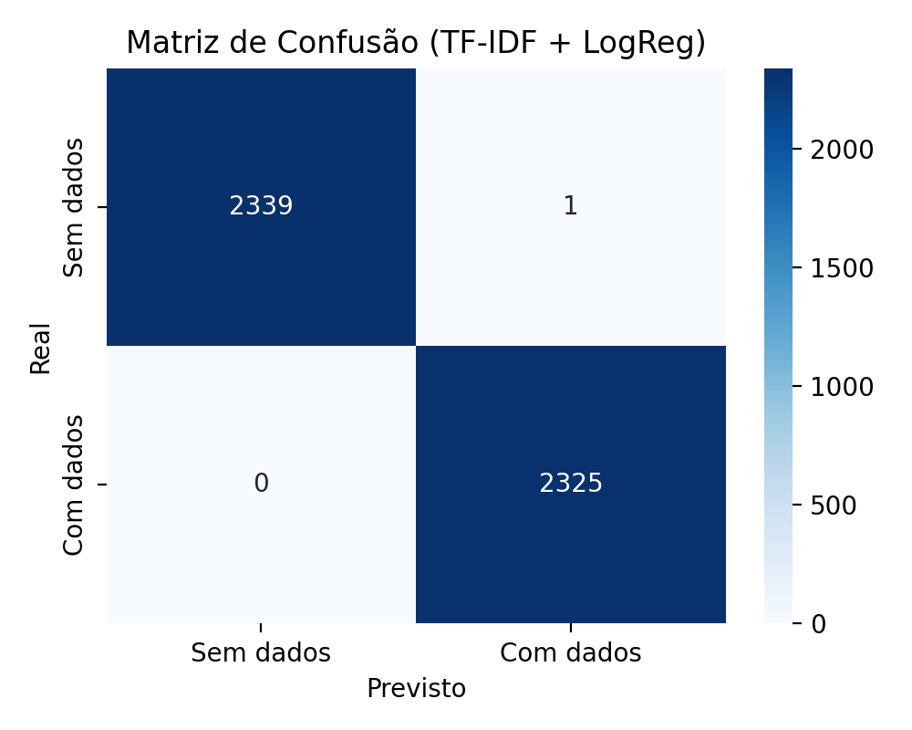
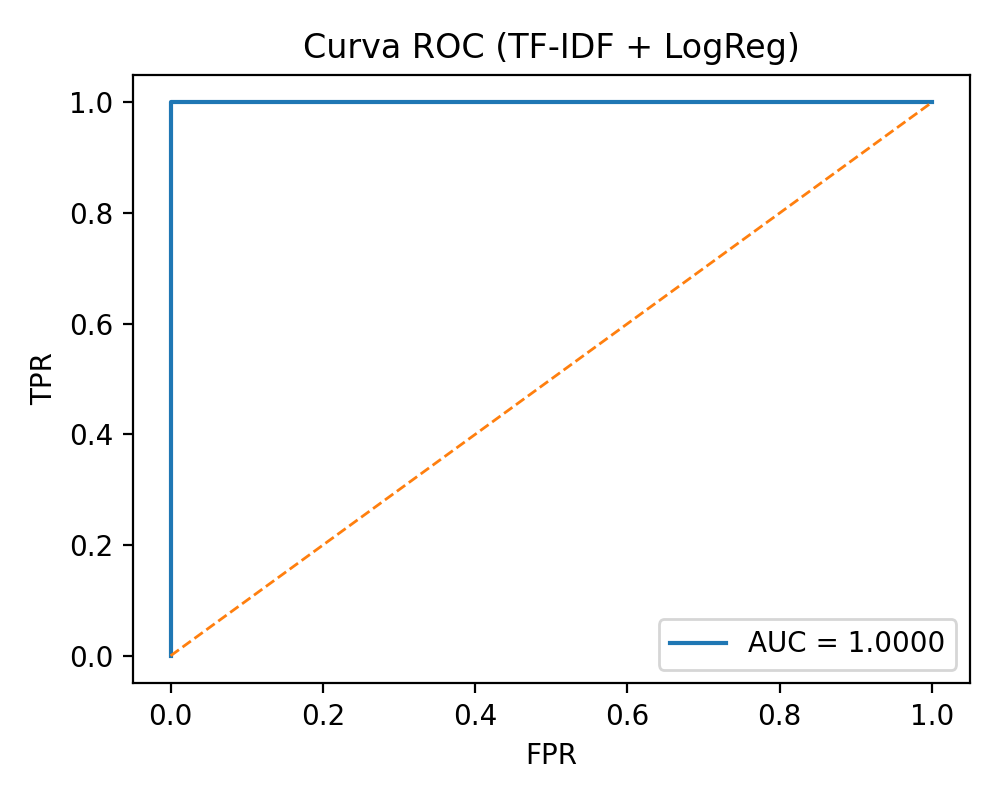
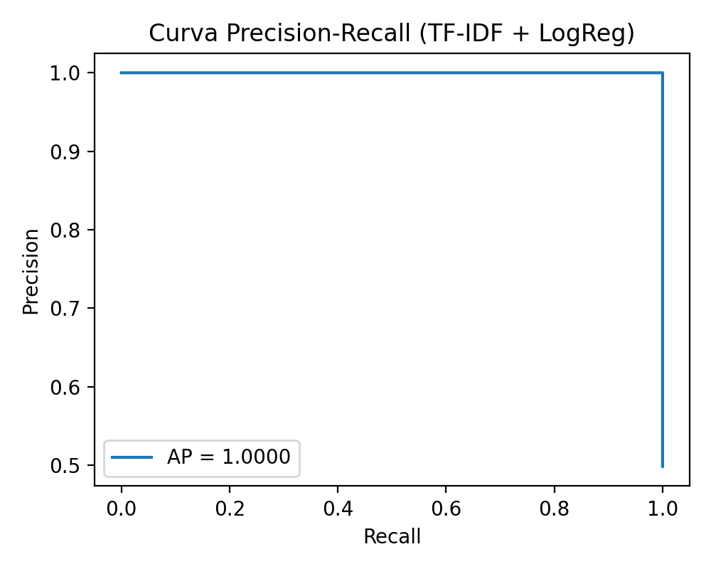
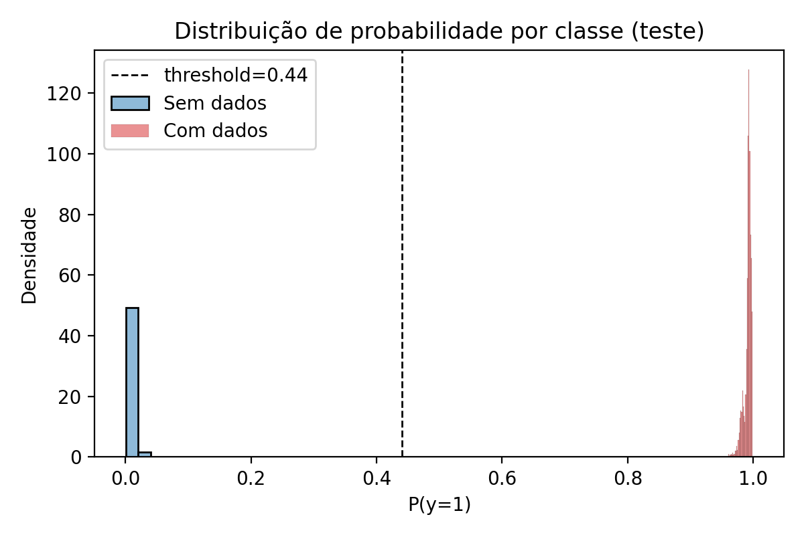
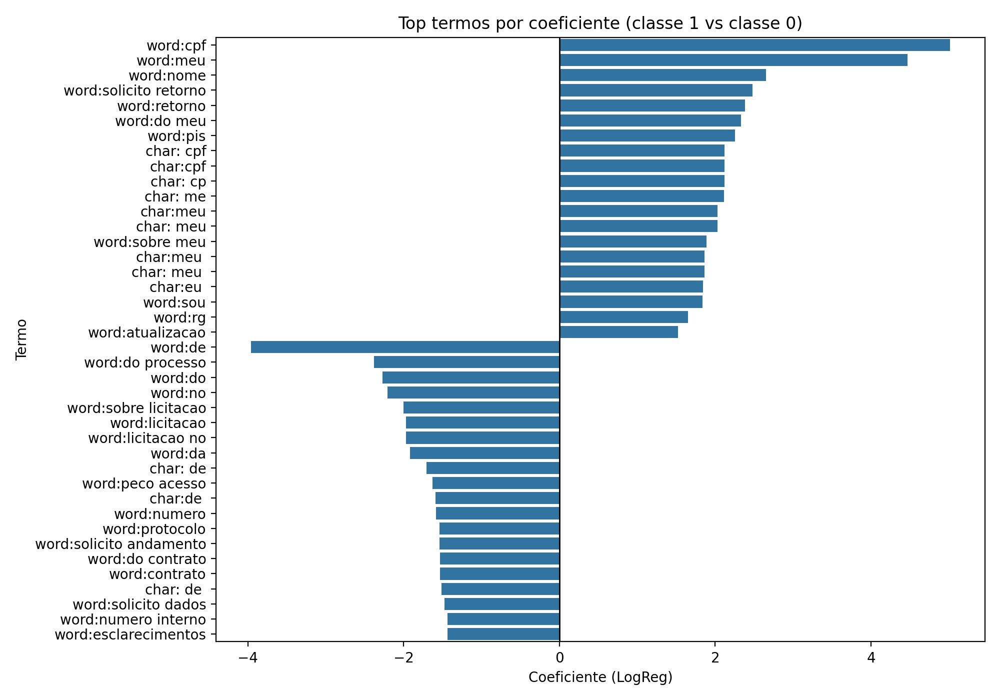

# Hackathon CGDF - Detecção de Dados Pessoais em Pedidos LAI

## Descrição do Projeto

Solução desenvolvida para o **1º Hackathon em Controle Social: Desafio Participa DF** na categoria **Acesso à Informação**.

Este projeto implementa um modelo de Machine Learning capaz de identificar automaticamente pedidos de acesso à informação (LAI) que contenham dados pessoais (ex.: CPF, RG, telefone, e-mail, endereço, nome) e que, portanto, deveriam ser classificados como **não públicos** conforme a LGPD.

---

## Objetivo

Entregar um modelo reprodutível que maximize o F1 (P1 do edital) e seja simples de executar e auditar.

---

## Execução rápida

### 1) Instalar dependências

```bash
pip install -r requirements.txt
```

### 2) Rodar uma predição

```bash
py .\src\predict_final.py "Meu CPF é 123.456.789-01. Solicito informações." --json
```

### 3) Rodar teste adversarial (sanity check)

```bash
py .\test_frases.py
```

---

## Métricas (reprodutíveis)

As métricas são geradas automaticamente pelo treino e salvas em `models/metricas_tfidf.json`.

Último treino registrado (ver `models/metricas_tfidf.json`):
- **F1**: 0.999785
- **Precisão**: 0.999570
- **Recall**: 1.000000
- **Acurácia**: 0.999786
- **AUC**: 1.000000
- **Matriz de confusão**: VP=2325, FP=1, VN=2339, FN=0

> Observação: essas métricas são do **split de teste** do dataset **sintético ampliado** (`data/dataset_pedidos_lai_aug.csv`). A avaliação oficial do hackathon ocorrerá no **subconjunto de controle** da CGDF (não disponível ao participante).

### Figuras (geradas a partir do modelo exportado)

Para (re)gerar as figuras:

```bash
py .\src\report_plots.py
```

**Matriz de confusão**



**Curva ROC**



**Curva Precision-Recall**



**Distribuição de probabilidades (teste)**



**Top termos (coeficientes do modelo)**



---

## Critérios do edital

O edital mede desempenho por **Precisão** e **Recall** e usa a fórmula:

```text
P1 = 2 × (Precisão × Recall) / (Precisão + Recall)   (equivalente ao F1)
```

Este repositório entrega (reprodutível):
- um modelo executável (`models/modelo_tfidf.pkl`) e um script de inferência (`src/predict_final.py`)
- treino reprodutível (`src/train.py`) com export de métricas (`models/metricas_tfidf.json`)
- documentação e relatório técnico (`docs/RELATORIO_TECNICO.md`)

---

## Estrutura do Projeto

```
hackathon_cgdf/
├── README.md                          # Este arquivo
├── requirements.txt                   # Dependências do projeto
├── data/
│   ├── dataset_pedidos_lai.csv       # Dataset de base (sintético rotulado)
│   └── dataset_pedidos_lai_aug.csv   # Dataset ampliado (gerado) para treino
├── models/
│   ├── modelo_tfidf.pkl              # Modelo principal (TF‑IDF + LogReg)
│   ├── threshold.json                # Threshold escolhido (otimiza F1)
│   └── metricas_tfidf.json           # Métricas do modelo exportadas
├── src/
│   ├── predict_final.py              # Script de classificação (usa modelo_tfidf.pkl)
│   ├── train.py                      # Geração de dataset + treino + export
│   └── features_pii.py               # Detecção explicável (tipos encontrados)
├── notebooks/
│   ├── 01_build_dataset.ipynb        # Notebook: geração do dataset ampliado
│   └── 02_train_eval_export.ipynb    # Notebook: treino/avaliação/exportação
└── docs/
    └── feature_importance_final.png  # Gráfico de importância das features
```

---

## Instalação

### Pré-requisitos

- Python 3.9 ou superior
- pip (gerenciador de pacotes Python)

### Passos de Instalação

1. **Clone o repositório:**
```bash
git clone <URL_DO_REPOSITORIO>
cd hackathon_cgdf
```

2. **Crie um ambiente virtual (recomendado):**
```bash
python -m venv venv
```

3. **Ative o ambiente virtual:**

- Windows:
```bash
venv\Scripts\activate
```

- Linux/Mac:
```bash
source venv/bin/activate
```

4. **Instale as dependências:**
```bash
pip install -r requirements.txt
```

---

## Uso

### Classificação de um único pedido

```bash
python src/predict_final.py "Texto do pedido LAI"
```

**Exemplo:**
```bash
python src/predict_final.py "Meu CPF é 123.456.789-01. Solicito informações sobre meu processo."
```

**Saída esperada:**
```
======================================================================
RESULTADO DA CLASSIFICAÇÃO
======================================================================
Contém dados pessoais: SIM
Confiança: 99.98%
Probabilidade (Sem dados): 0.02%
Probabilidade (Com dados): 99.98%
Tipos de dados encontrados: CPF
Total de padrões detectados: 1
======================================================================
```

### Saída em formato JSON

```bash
python src/predict_final.py "Texto do pedido" --json
```

**Exemplo de saída JSON:**
```json
{
  "contem_dados_pessoais": true,
  "confianca": 0.9998,
  "probabilidade_sem_dados": 0.0002,
  "probabilidade_com_dados": 0.9998,
  "tipos_dados_encontrados": ["CPF", "RG"],
  "total_padroes": 2,
  "total_tipos": 2
}
```

### Uso como módulo Python

```python
from src.predict_final import classificar_pedido

# Classificar um pedido
resultado = classificar_pedido("Texto do pedido LAI")

# Acessar resultados
print(resultado['contem_dados_pessoais'])  # True/False
print(resultado['confianca'])              # 0.0 a 1.0
print(resultado['tipos_dados_encontrados']) # Lista de tipos
```

---

## Tipos de Dados Detectados

O modelo identifica os seguintes tipos de dados pessoais:

| Tipo | Padrão | Exemplo |
|------|--------|---------|
| **CPF** | `XXX.XXX.XXX-XX` ou 11 dígitos | `123.456.789-01` |
| **RG** | `XX.XXX.XXX-X` | `12.345.678-9` |
| **Telefone** | `(XX) XXXXX-XXXX` | `(61) 91234-5678` |
| **E-mail** | `usuario@dominio.com` | `joao@email.com` |
| **CEP/Endereço** | `XXXXX-XXX` | `70000-000` |
| **Data** | `DD/MM/AAAA` | `01/01/1990` |
| **PIS/PASEP** | `XXX.XXXXX.XX-X` | `123.45678.90-1` |
| **Título de Eleitor** | 12 dígitos (com contexto) | `123456789012` |

---

## Metodologia (resumo)

### 1. Dataset

- **Base**: `data/dataset_pedidos_lai.csv` (sintético rotulado existente)
- **Ampliação**: `data/dataset_pedidos_lai_aug.csv` gerado por `src/train.py --build-dataset` com:
  - positivos com variações realistas (nome puro, endereço sem CEP, CPF espaçado, email ofuscado, etc.)
  - **hard negatives** com padrões de números comuns em pedidos reais (SEI/protocolo/matrícula/ocorrência/nota fiscal), usando a amostra `AMOSTRA_e-SIC - Amostra - SIC.csv` como base textual (com *scrub* de PII)
- **Divisão**: 70% treino, 15% validação, 15% teste (estratificado, seed fixo)

### 2. Engenharia de Features

Neste projeto, a “feature engineering” principal é **textual**, via TF‑IDF:
- **Word n-grams (1–2)** para capturar termos como `cpf`, `me chamo`, `meu nome`, `endereço`, etc.
- **Char n-grams (3–5, char_wb)** para capturar variações de formato (`123 456 789 01`, emails ofuscados, etc.)

### 3. Modelo Utilizado

- **Algoritmo:** TF‑IDF + Logistic Regression (modelo linear)
- **Threshold tuning:** o limiar de decisão é escolhido para maximizar **F1** na validação (ver `models/threshold.json`)

---

## Resultados da Validação

### Modelos Testados

| Modelo | F1-Score | Precisão | Recall | Acurácia | AUC |
|--------|----------|----------|--------|----------|-----|
| **TF‑IDF + Logistic Regression** | **ver `models/metricas_tfidf.json`** |  |  |  |  |

---

## Tecnologias Utilizadas

- **Python 3.9+**
- **Scikit-learn** - Machine Learning
- **Pandas/NumPy** - Manipulação de dados
- **Matplotlib/Seaborn** - Visualização
- **Joblib** - Serialização do modelo

---

## Treino (reprodutível)

### 1) Gerar dataset ampliado

```bash
py .\src\train.py --build-dataset
```

### 2) Treinar e exportar o modelo

```bash
py .\src\train.py --train
```

### 3) Rodar teste adversarial (100 frases)

```bash
py .\test_frases.py
```

---

## Uso de IA (conforme edital)

O edital permite uso de IA desde que documentado. Caso tenha sido utilizado IA durante o desenvolvimento, listar claramente:
- modelo(s) usados, prompts/assistência (se aplicável)
- bibliotecas e fontes
- o que foi automatizado vs. o que foi decidido pelo time
*(Ajuste esta seção conforme a sua submissão final.)*

---

## 👥 Autor

Solução desenvolvida para o **1º Hackathon em Controle Social - Desafio Participa DF**

Organizado pela: **Controladoria-Geral do Distrito Federal (CGDF)**

---

## 📄 Licença

Este projeto foi desenvolvido para fins de competição no Hackathon CGDF.

---

## 📞 Contato

Para dúvidas ou sugestões sobre o projeto, entre em contato através do repositório.

---

## Observações finais

- O repositório contém métricas locais do dataset sintético ampliado e ferramentas para reproduzir o treino.
- A avaliação oficial é feita pela CGDF em subconjunto de controle.
